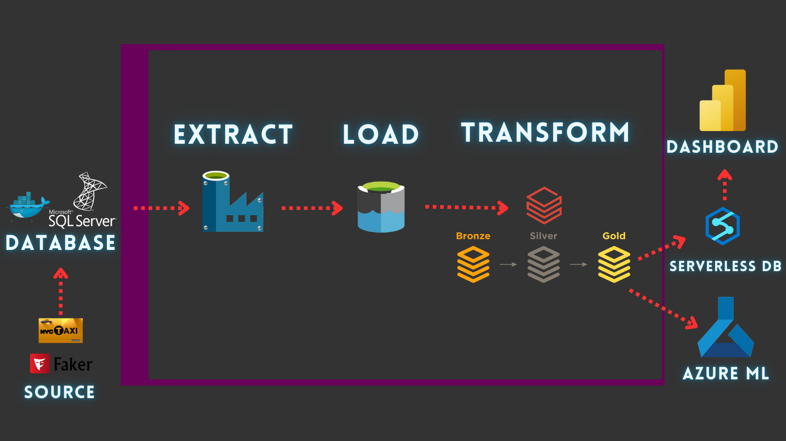

# Uber Data Pipeline & Analysis Project

## Project Overview
This project aims to build a data pipeline and warehouse for an Uber-like ride-hailing service that processes and stores ride, user, vehicle, and fare data. The goal is to analyze the NYC Taxi dataset from Kaggle, focusing on fare data, trip patterns, and sales performance across various dimensions. 

Key objectives include:
- **Data Ingestion**: Implement an efficient pipeline using Azure services to ingest data from the NYC Taxi dataset and Docker-hosted Uber database.
- **Data Processing**: Transform and clean the data using a Medallion architecture (Bronze, Silver, and Gold layers).
- **Data Analysis**: Analyze user behavior, trip performance, and fare trends to derive actionable insights.
- **Data Visualization**: Create interactive reports in Power BI to visualize key metrics and trends in the ride-hailing service.

## Architecture
The project follows the ELT (Extract, Load, Transform) model, leveraging Azure Data Factory (ADF), Databricks, and Azure Synapse. The pipeline starts with data ingestion, followed by transformation across multiple stages, ultimately loading data into a star schema for business intelligence and analytics.

## Tech Stack
- **Data Ingestion & Orchestration**: Azure Data Factory (ADF), Apache Airflow
- **Data Processing**: Azure Databricks (Apache Spark)
- **Data Storage**: Azure Data Lake Gen2 (Delta/Parquet), Azure Synapse Analytics
- **Data Visualization**: Power BI
- **Containerization**: Docker for local database emulation
- **Security**: Azure Key Vault
- **Version Control**: Git

## Docker Integration
Docker is used to create a consistent and isolated development environment. The Docker container hosts the Uber-like database, allowing seamless integration and testing of the data ingestion pipeline. By using Docker, the project can be easily deployed and run on any machine with Docker installed, facilitating collaboration among team members.

## Apache Airflow
Apache Airflow is utilized for orchestrating complex workflows and scheduling tasks within the data pipeline. It enables the automation of data ingestion and transformation processes, ensuring that tasks are executed in the correct order and at specified intervals. Key features include:
- **DAG Management**: Workflows are defined as Directed Acyclic Graphs (DAGs), allowing clear visualization of task dependencies.
- **Task Scheduling**: Regularly scheduled data ingestion and transformation tasks to maintain up-to-date datasets.
- **Monitoring**: Built-in monitoring and logging features to track the progress and success of tasks.

## Data Ingestion Process (ELT)
### Data Source
The primary data source for this project is the **NYC Taxi Dataset** from Kaggle, which contains detailed information about taxi trips, fare costs, and other ride-related attributes.

### Ingestion via ADF
Data is ingested using Azure Data Factory from the Docker-hosted Uber database. Key tasks include:
- **Lookup Activity**: Retrieves table and schema names.
- **ForEach Activity**: Iterates through tables to ingest data.
- **Copy Activity**: Loads data into Azure Data Lake Storage Gen2 as Parquet files.

## Medallion Architecture
The data is processed using the **Medallion architecture**, which consists of the following layers:

### 1. Landing to Bronze
- **Objective**: Ingest raw data and store it in Delta Lake format.
- **Transformations**: Adds metadata columns and retains raw data for historical reference.

### 2. Bronze to Silver
- **Objective**: Clean and validate Bronze data.
- **Transformations**: Standardizes column names, tracks changes, and implements Slowly Changing Dimensions (SCD) Type 1.

### 3. Silver to Gold
- **Objective**: Model the data in a star schema for reporting and analytics.
- **Transformations**: Aggregates data and creates atomic facts and dimensions.

## Star Schema Design
The Gold layer contains a **star schema** including:

### Dimensions:
1. **dim_user**: Information about users, including drivers and passengers.
2. **dim_payment**: Details about payment methods (e.g., credit cards, cash).
3. **dim_location**: Geographic data (pickup and dropoff locations).
4. **dim_calendar**: Time and date information for analysis.

### Fact Table:
- **fct_request**: Holds data about ride requests, trip details, and associated costs, including metrics like `BaseFare`, `TipAmount`, `TotalCost`, and `distance_traveled`.

## Conclusion (Insights Gained)
**TBD**: This section will include insights gained from analyzing the Uber ride data, focusing on trends in fare costs, trip patterns, user behavior, and vehicle performance. It will also discuss how these insights can optimize ride pricing, promotions, and improve overall service quality.

---

This README serves as a concise overview of the Uber Data Pipeline & Analysis project. It outlines the main objectives, architecture, tech stack, and data processing methodology, providing a comprehensive view of the project's goals and structure.
